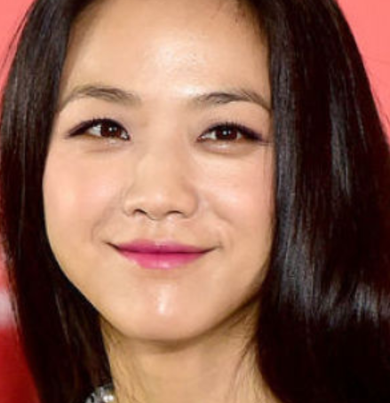

Code base is https://docs.opencv.org/3.3.0/dc/dcb/tutorial_xphoto_training_white_balance.html

Train datas from http://www.cs.sfu.ca/~colour/data/shi_gehler/
****
Peter Gehler and Carsten Rother and Andrew Blake and Tom Minka and Toby Sharp, "Bayesian Color Constancy Revisited,"
Proceedings of the IEEE Computer Society Conference on Computer Vision and Pattern Recognition, 2008. 
and http://www.kyb.mpg.de/bs/people/pgehler/colour/index.html.
****

color_balance_model.yml is traind with above.

#### origin

#### white balanced?

----
P.S.:  
In doing this, I contribute some of the code. https://github.com/opencv/opencv_contrib/pull/1679
